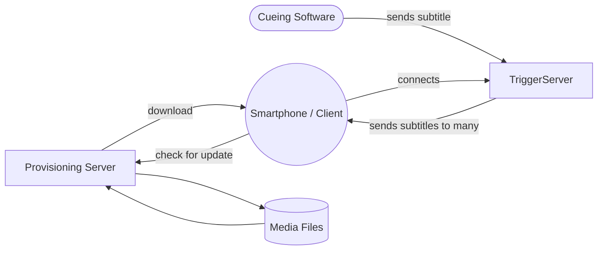
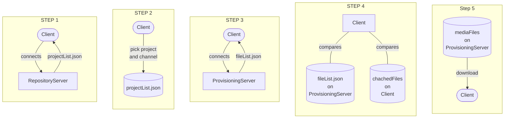

<a href="#table-of-content">Jump to: Table of Contents</a>

# Open-Theater-API

Open Theater aims to give theaters and other event venues the possiblity to create a software through which audiences can receive personal **live subtitles**, **translations**, **audio descriptions** and **video** on smartphones and other devices. Those contents can be send and received live and in synch with the live show running.

Open Theater's goal is to give a set of starting points to developers building translation applications for theaters and event spaces.

Translations can be in form of text, video or audio snippets. Text can be directly delivered from a subtitle cueing software. Video and audio data have to be downloaded ("provisioned") by user devices before the show starts in order to be played/displayed on time in a live show.

To achieve that, Open Theater defines
1. an <a href="#table-of-content">API</a> to send, provision & trigger live subtitles/translations. (<a href="#table-of-content">Documented in this very repository</a>).

Open Theater also provides **reference implementations** in form of 

2. <a href="https://gitlab.com/open-theater/open-theater-client-capacitorjs">a mobile App for ios and Android devices</a>, as well as 
3. a Desktop App sending subtitles and media cues to (**todo: link public**)
4. a <a href="https://gitlab.com/open-theater/open-theater-trigger-server-demo">trigger server</a> instance that will broadcast those cues to all registered mobile devices.

<a href="https://www.bmbf.de/"></a>

via:
<a href="https://www.prototypefund.de/">prototypefund.de</a>

## Basic Flow

The following flow documents a *abstracted* view of the communication between the 4 main actors of the API flow: 
- Smartphones / Clients (user devices receiving media files and subtitles)
- Provisioning Server (in reality more than one server and divided into repositories and provisioning server but here summarized)
- Cueing Software (apps that send subtitle or other cues in a live show)
- Trigger Server



a more technically detailed description can be found at <a href="#data-flow-of-provisioning-process">Data Flow of Provisioning Process</a>. 

## Basic Structure

The API proposals are split into 2 main sections:

1) <a href="#provisioning-api">*Provisioning API*</a> - defining how a repository server, provsioning server and clients communicate and how clients and servers reference cached media Assets in their filesystems
2) <a href="#trigger-api">*Trigger API*</a> - defining how a trigger server forwards triggers/cues to clients to display/play text, video and/or video on client devices.

In the future there might be additional APIs added. In discussion are (amongst others): 
- Renderer Plugin API
- optional Authentication/Ticketing API)

## Getting Started / Target Audience

This repository is for developers, building software for theaters and event venues, who want to implement Open Theater functionality into their apps.

It is also for software architects who want to contribute to this prototypical API spec by criticising, making proposals for features and working with us on future iterations of this API.

If you want to just build your own Open Theater compatible mobile App, you 

- a) can check out our <a href="https://gitlab.com/open-theater/open-theater-client-capacitorjs">demo mobile app for iOs and Android devices</a> and modify it to your liking.
- b) You will also have to setup a server serving a repository (minimum: a projectList.json file),
- c) a provisioning server (minumum: serving fileList.json files for each channel and the corresponding media files, if any are needed)
- d) a trigger server (see our minimal demo implementaion)
- e) and at last a Cueing Software that sends Open Theater trigger payloads (minimum: see our minimal desktop sender and adapter app, maximum: build your own adapter app from the Cueing Software of your choice)

Sounds like a lot?:

a) includes already everything for b) and c) inside of `www/mockserver/`(you only need to serve it on the network).

d) and e) are our already working minimal setups you can install right away to get started.


Open Theater is a prototype, so you will probably have questions early on. Please feel free, to write us tickets to raise issues and ask for features and explanations and/or contact us at <a href="mailto:mail@open-theater.de">mail@open-theater.de</a>


We hope to also provide adapter apps to send cues/subtitles from several common stage cueing apps in the future. But we will need your help to develop and find those.

## Table Of Content

[[_TOC_]]

## Status of this document
This document currently is unfinished and not yet in a usable but in an experimental state.

<a href="https://tools.ietf.org/html/rfc2119">RF 2119</a> *is planned* to be used in the first published version of this document.

## Underlying technologies

The API is based on socket.io and HTTP as transport protocols.

HTTP GET Requests to serverendpoints are used to lead a client app through the provisioning process, which organized all media files needed 

## Agents / Actors of API processes

#### Client
A client. Usually an application running on one single user's device (mobile phone, laptop etc.). Usually contains of at least 2 User Interfaces: The Provisioning UI and the Trigger UI.

#### Repository Server
A server hosting an overview over several projects that MAY recide on different servers (provisioning servers and/or trigger servers).
The repository server and the provisioning servers make up the provisioning backend. 

The repository is it's own server, so many theaters and event venues can host their data decentralized on different servers. The repositories work like a direction sign to all the pieces and theaters that have been listed inside of a given repository.

#### Provisioning Server
The provisioning server hosts all files that need to be downloaded and chached by clients in the provisioning process. The data is organized by <a href="#project">project</a> and it's <a href="#channel">channels</a>.

#### Trigger Server
A server hosting one or more project and/or channel specific trigger endpoints. Delivers real time trigger payloads to clients that are subscribed to its endpoints.

#### Cueing Software
Software that sends cues in the context of a live show. This can be a specialized subtitle software, the Open Theater demo desktop sender app or any software used by theater technicians and/or subtitle personell in a live show. It will need to either support sending Open Theater API or to translate it's own outgoing signals into Open Theater trigger payloads via an adapter app.

## Provisioning API

status: test ready

### Basic Flow Provisioning API




### Endpoints

The provisioning API functions based on HTTP GET endpoints that all can be reached by clients.
It is planned to expanded by open-api v3 spec files in the future.

- Repository Server Endpoint: `<Repository URI or IP>/projectList.json` references then projectspecific trigger API endpoints as well as
- several channel specific Provisioning Endpoints: `<FileServer>/fileList.json`
- as well as all the files listed in the above.

### Terminology

#### Repo List
The Repo List is a optional List of <a href="#repository-definition">repository definitions</a>. It MAY be used to give clients a list of <a href="#repository">repositories</a> to choose from automatically or via user interaction.

If used, the order of repository definitions in the repository list MUST be in the order of priority of the given repository endpoints. In case of an automatic choice by the client, the client MUST try to connect to the repositories in the order they are listed in.

This way it can for example be ensured that clients first try local wifi networks before they switch to wide area networks.

Example:
```json
[
  { "ssid": "private.open.theater", 
    "pw": "testpassword1234",
    "serveruri": "http://192.168.178.38:8080/mockserver/example-repo/projectList.json"
  },
  {
    "serveruri": "http://192.168.178.38:8080/mockserver/example-repo/projectList.json"
  },
  {
    "serveruri": "https://www.open-theater.de/example-repo/projectList.json"
  }
]
```

#### Repository Definition 

Defines a <a href="#repository">repository</a> endpoint within a <a href="#repo-list">RepoList</a>.

MUST provide field `serveruri` containing a String with a valid <a href="https://tools.ietf.org/html/rfc3986">URI</a>

MAY provive field `ssid` containing a String defining a wifi ssid if the serveruri MUST be connected in a local area network only

MAY provide field `password` containing a String IF field `ssid` is present to give access to password protected local wireless networks

The client MUST use the SSID and PASSWORD if provided and MUST NOT use the SERVERURI via a different uplink.
If the client should connect to the same SERVERURI via another uplink in case the wifi connection fails, the repo list MUST provide another repository endpoint definition including the SERVERURI without SSID

Example:
```json
{ 
  "ssid": "private.open.theater", 
  "pw": "testpassword1234",
  "serveruri": "http://192.168.178.38:8080/mockserver/example-repo/projectList.json"
}
```

#### Repository
A repository (or repo) is a data store that hosts a collection of available <a href="#project">projects</a> and exposes those via a <a href="#project-list">project list</a>

Repositories MAY pull and compile data from other repositories, IF the owners of those repositories allow it. **(still to be defined how)**.

#### Project List
The project list is a text file exposed by a <a href="#repository">repository</a> to clients, listing all <a href="#project">projects</a> the repository provides and/or manages.

It MUST be exposed as `./projectList.json` on a repository's webserver base URL.

#### Project
A Project describes and references a real life event (for example a theater show) that provides <a href="#channel">channels</a> to different media translations.

MUST provide field `projectUuid` which is a string formatted as <a href="https://tools.ietf.org/html/rfc4122#section-4.1.3">UUID V4</a>.

MUST provide field `projectPath` which is a list of path compatible machine readable strings (no spaces, no special characters, case-insensitive) **(todo: needs reference to standard or define its own clear norm, e.g. URI safe path notation)**, describing the path of the project as it SHOULD be displayed by the client to users. Clients MAY hide or show certain layers of the projectPath depending on filters, UX philosophy etc. `projectPath` also describes the path that projects assets downloaded via the provisioning API MUST use within the clients filesystem. Clients MAY prepend to the path to add client specific root directories.

MUST provide field `channelList` which is a list of channel objects.

MUST provide field `triggerUri` containing a string with a valid <a href="https://tools.ietf.org/html/rfc3986">URI</a> to an Open Theater <a href="#trigger-api-endpoint">trigger API endpoint</a>.

MAY provide field `projectLabel` containting a list of human readable strings which MUST have the same length as `projectPath`. The strings inside projectLabel can contain UTF-8 compatible characters that are not allowed inside of `projectPath`. Clients SHOULD map the items from `projectLabel` to items of `projectPath` and preferably display the `projectLabel` Strings to users.
(this way we can display directory structures with spaces and emojis etc if needed).

Example:
```json
{
    "projectUuid": "ff277516-121b-4304-b256-d5a8b70e136a",
    "projectPath": [
      "Staatstheater_Musterstadt",
      "Kammerspiele",
      "Shakespears_anderes_stück"
    ],
    "triggerUri": "https://foo.bar/project2",
    "channelList": [
      {
        "channelUuid": "f6b070fe-0f89-4c1e-8c43-993abd9e851f",
        "provisioningUri": "https://open-theater.de/example-repo/staatstheater_Musterstadt/kammerspiele/shakespears_anderes_stueck/DE_UNTERTITEL/fileList.json",
        "label": "DE Untertitel",
        "containerIds": ["text_DE"]
      },
      {
        "channelUuid": "5e23407e-1d35-4953-bf17-5e07e11105d4",
        "provisioningUri": "https://open-theater.de/example-repo/staatstheater_Musterstadt/kammerspiele/shakespears_anderes_stueck/EN_UNTERTITEL/fileList.json",
        "label": "EN Subtitles",
        "containerIds": ["text_EN"]
      }
    ]
}

```

#### Channel
A channel describes a single media translation of its given parent <a href="#project">project</a>.

MUST provide field `channelUuid` containting a string formatted as  <a href="https://tools.ietf.org/html/rfc4122#section-4.1.3">UUID V4</a>. clients MUST use the channelUuid as last directory in the filepath defined by the parents project `projectPath` to cache/save asset media files when provisioning. client MAY use the channelUuid as human readable identifier IF `label` is not present.

MAY provide field `triggerUri` containing a String with a valid <a href="https://tools.ietf.org/html/rfc3986">URI</a> to an Open Theater <a href="#trigger-api-endpoint">trigger API endpoint</a> that CAN overwrite the parent project level `triggerUri` (for example to have slimmer data packets per cue). This CAN be used by a client but a client MAY also choose to default to the more verbose project's `triggerUri`. We RECOMMEND using this only in projects with excessive data being send over a high number of channels and otherwise omit this `triggerUri`.

MAY provide field `provisioningUri` containing a String with a valid <a href="https://tools.ietf.org/html/rfc3986">URI</a> to an Open Theater <a href="#provisioning-endpoint">provisioning endpoint</a> if files need to be cached before entering the <a href="#trigger-api">trigger API</a>.

<!--MUST provide field `channelTypes` containing an Array of strings describing predefined channel content types as `text`,  `video`, `audio` **(to be defined)**. This field is to be used for clientside styling and/or UX purposes as well as for automatic detection clientside to which renderer or renderer configuration might be used.-->

MUST provide field `containerIds` containting an Array of strings, each describing the unique id of each content div (track) that the <a href="#renderer">renderer</a> of this channel will have to expect in incoming <a href="#trigger-payload">trigger payloads (cues)</a>.
Each key MUST be formatted following the format `renderingMediumType_languagelabel`, where `renderingMediumType` should be replaced by the predefined channel content types  `text`,  `video`, `audio`, `image` **(to be defined)** and `languagelabel` should be replaced by the <a href="https://en.wikipedia.org/wiki/ISO_639-1">ISO 639-1 language code</a> (if applicable) or another custom flag identifying this channel. This parameter is to be used for clientside styling and/or UX purposes as well as for automatic detection clientside to which renderer or renderer configuration might be used. It will be used as ID of each div built by the renderer and as the keys identifying distinct  in the trigger API.
<!--
**Spec Note**: *this spec might be worth re-examination for later versions of this spec for it seems a little too unintuitive. Yet at the current moment it seems necessary to have flexible renderers*

Might be replaceable automatically by the more human readable channelTypes_channelLabel ! TODO: check if this would break some logic in the renderer and/or other parts of the spec!
-->

MAY provide field `label`containting a String describing the content of the channel in human readable form. Clients SHOULD display the label for users if provided and prefer it over channelUuid. **(todo: needs character limit recommendations)**

MAY provide field `renderer` containing a String identifying the needed renderer for the client IF no standard renderer can be used to display this channels content. IF so this channel's `provisioningUri` endpoints MUST list and deliver the necessary renderer. Clients MAY forbid to download renderers and ignore channels that require custom `renderers`. `renderer` defaults clientside to a defaultRenderer which can display all default `containerTypes` (for more about containerTypes and renderers: see <a href="#trigger-api">Trigger API</a>)

MAY provide a field `lastmodified` containing an integer timestamp **(todo: reference standard)** marking the last time any asset inside of the `provisioningUri`s <a href="#fileList">fileList</a> was modified. `lastmodified` MUST only be present IF a `provisioningUri` is provided. IF `lastmodified`is provided a repository's server MUST keep it up to date. RECOMMENDED update timeframe is every 15 minutes. 
Clients MAY use channel.lastmodified to compare with their cached <a href="#fileList">fileList</a> for human readablility and UX (e.g. to signal that a channels ressources have been downloaded before and seem up to date) but they MUST NOT use it automatically to skip any checks with the provisioning endpoint of a given channel before entering the trigger API.

*Example:*
```json
{
  "channelUuid": "f6b070fe-0f89-4c1e-8c43-993abd9e851f",
  "provisioningUri": "https://open-theater.de/example-repo/staatstheater_Musterstadt/kammerspiele/shakespears_anderes_stueck/DE_UNTERTITEL/fileList.json",
  "label": "DE Untertitel",
  "containerIds": ["text_DE"]
}
```

#### File List
A JSON file hosted on a provisioning server and within a client's filesystem for each channel cached.

MUST be called `fileList.json`.

MUST be served at root level relative to it's <a href="#channel">channel's</a> `provisioningUri` IF on provisioning servers.

MUST be saved at root level relative to it's channel's cached file location IF on client filesystem.

MUST provide field `files`, containing a list of objects with <a href="#file-definition">File Definitions</a>.

Example:
```json
{
    "files":[
        { "filepath": "1.mp4", "filesize": 12, "lastmodified": 16037178357021 },
        { "filepath": "2.mp4", "filesize": 64, "lastmodified": 16037178356002 },
        { "filepath": "3.mp4", "filesize": 64, "lastmodified": 16037178356002 },
        { "filepath": "4.mp4", "filesize": 64, "lastmodified": 16037178357004 }
    ]
}

```

#### File Definition
Part of <a href="#file-list">file list</a>. Describes one asset file for caching in the provisioning API.

MUST provide field `filepath` containing a URI path compatible string, describing EITHER the relative position of an asset file to the fileList's own location (defined by the `provisioningUri` of it's parent channel) OR an absolute position defined by the URI.

MUST provide field `lastmodified` containting an integer value describing a timestamp in <a href="https://en.wikipedia.org/wiki/Unix_time">Unix Time</a>.

SHOULD provide field `filesize`, containting an integer value describing the file's size in bytes.

Provisioning servers MUST make sure that the listed filepaths are accessible by clients when listed. We RECOMMEND to test regularly and automated all listed filepaths.

Example:
```json
{ "filepath": "1.mp4", "filesize": 12, "lastmodified": 16037178357021 }

```


### Data flow of provisioning process

Clients MUST follow the following steps in order:

1. Client opens <a href="#repo-list">Repo List</a> and works through the <a href="#repository-definition">Repository Definitions</a> in order of their listing following the rules of the specifications. (IF ssid/pw present: use local wifi, else use WAN etc.). Client uses the response data from the first successful connection to a listed repositoriy server <a href="#project-list">project list</a>.

2. Client presents all relevant projects and their channels from the project list to users. Client MAY apply filters based on their capabilities (e.g. custom renderers) and configurations (e.g. user choices). Client CAN choose the styling and order it presents the contents to the user, but MUST follow the specifications of <a href="#project">project</a> and <a href="#channel">channel</a> (`label`over `channelUuid`, etc. etc.).

3. Client / User chooses one or more channels from the project list.

4. Client connects via HTTP GET request to the provisioning endpoint's `/fileList.json` of each chosen channel

5. Client uses the <a href="#file-list">file List</a> to compare ALL files listed on the channels provisioning endpoint with ALL files cached inside the client's filesystem by using the locally cached fileList

6. Client downloads ALL files that are not up to date with the files chached and updates it's channel specific local fileList accordingly.

7. Client waits until ALL updates and downloads of AT LEAST one channel are finished

8. Client provides user possiblity to access a project's trigger API and it's user interface. (e.g. via button press). Client MUST have ensured that Step 7 has been finished for the project before letting users access the trigger client.

9. Client hands over all information about the project chosen to the trigger client.


<!-- TODO: add more details over decision trees in the flow here. -->

</img>

### Provisioning API Notes

- channels MAY have their own Trigger endpoints, only listing content and style changes for one channel, but every project MUST have a verbose trigger endpoint including ALL trigger payloads for ALL channels


## Trigger API

status: test-ready

The Trigger API organizes incoming trigger payloads and defines which of their contents have to be displayed and how they have to be styled inside of a client.

In general: The client has to hand over user configuration (which channels to provide for which project) to the trigger UI. After receiving the configuration, the trigger UI connects with the specified trigger endpoint(s) and listens to incoming socket.io-events **(in later versions of this API pure websocket connections and/or MQTT could also be implemented)**

An incoming Trigger, defines changes via its payload. That means: The client shows the specified content until
- a) it reached its end (in the case of audio and video) or
- b) a new trigger payload overwrites the currently displayed/playing content

### Terminology

#### Show Interface

A User Interface provided by a client to display and/or play contents described in <a href="#trigger-payload">a trigger playload</a>. 

MUST include at least one <a href="#renderer">renderer</a> to present contents to users. At least one renderer MUST serve as the <a href="#default-renderer>default renderer</a>.

MAY switch to <a href="#custom-renderer">custom renderers</a> IF trigger payload, <a href="project">project</a> and/or client configuration allow.

#### Trigger Payload

A JSON formatted payload describing the contents to be displayed and/or played within a client's <a>show interface's</a> <a href="#renderer">renderers</a>.

MUST provide at least one of the following fields `content` and/or `styles`. MAY only describe one of them as changes.

MAY provide field `content` containing a <a href="#content-object">content-object</a> of <a href="#content">contents</a> of each <a href="#channel">channel</a>, describing the unstyled changes of content on receiving of this trigger payload.

MAY provide field `styles` containing a <a href="#styles-object">styles-object</a>, describing the styling changes valid on receiving this trigger payload.

SHOULD provide field `timestamp` containting an integer value describing a timestamp in <a href="https://en.wikipedia.org/wiki/Unix_time">Unix Time</a> indicating the time this payload was sent by a <a href="#cue-generator">cue-generator</a>

Example:
```json
{
  "timestamp":123445667778,
  "content":{

    "text_de":"das ist deutsch",

    "text_en":"this is english",

    "html_doesnotexist": "test",

    "video_de": "assets/test.mp4",

    "image_de": "https://picsum.photos/300/300"

  },
  "styles": {
      "#text_de": {
        "classes": [],
        "inline": {
          "backgroundColor": "yellow",
          "border": "4px solid red"
        },
        "transitions": {
          "fadeInClass": "animate__fadeIn",
          "fadeInTime": 100,
          "fadeInDelay": 100,
          "fadeOutClass": "animate__fadeOut",
          "fadeOutTime": 100,
          "fadeOutDelay": 100
        }
    }
  }
}
```

#### Content Object

A content Object is part of a <a href="#trigger-payload">trigger payload</a> and describes the content changes of one trigger cue. 
It lists the contents for all channels that MUST change immediately after receiving the parent trigger payload. 

MUST list the changes as key-value pairs, where the key MUST be a valid `containerId` within this channels provisioning defintion.

Example:
```json
"content":{

    "text_de":"das ist deutsch",

    "text_en":"this is english",

    "html_doesnotexist": "test",

    "video_de": "assets/test.mp4",

    "image_de": "https://picsum.photos/300/300"

  }
```

#### ContentPreload Object

A contentPreload Object is an optional part of a <a href="#trigger-payload">trigger payload</a>. (**ATTENTION: currently not yet implemented in the demo client**)

It describes what content changes a client SHOULD expect within the next incoming trigger payloads.
It instructs a client to preload media files - if possible - into its rendering context, to give the client the chance to limit loading/buffering delays on receiving the content trigger cue within a <a href="#content-object">content Object</a>.

<!--Continue here-->

#### Track
A track is the representation of data **inside of each field of a content object**. It represents ONLY one medium (see <a href="#containertype">containerType</a>) being displayed/played/triggered within the renderer.

A track is always composed from the key-value pair of 
- a) <a href="#containerId-trackcontent">containerId</a>
- b) <a href="#containerContent-trackcontent">containerContent</a>

It is usually identified via the `containerId` provided inside of the channel via the channels provisioning parameter <a href="#channel">`containerIds`</a> and - on the trigger API - inside of a <a href="#content-object">

One Channel MAY have several tracks in parallel. 

Every track defined in `containerIds` MUST be displayed/played/updated if present in an incoming content object.

*Example*:

```json
"text_en":"this is english"
```

#### Container

A container is the box (most likely an HTML div element) in which a track's content is rendered.

It must be stylable with <a href="https://developer.mozilla.org/en-US/docs/Web/CSS">CSS</a> by addressing it with `#<containerId>`. So its CSS ID MUST be same as it's containerId.

##### ContainerId / TrackId

Every containerId MUST be a string starting with the name of the renderer the change is affecting (<a href="#containertype">containerType</a>) and an underscore, followed by  a track/language name. 

Because the containerId being used inside code as key value of a <a href="#track">, it must be formatted 

The containerIds used inside of a <a href="trigger-payload">trigger payload</a> MUST be defined before in the provisioning's <a href="#channel">channel definitions</a>. 

*Example:* 
`text_german` for the text renderer on channel "german" being affected.
The value can be whatever data structure is required by the renderer. For all default renderers that will be a string.

Inside of the <a href="#style-object">style object</a> containerIds can also be found but MUST be referenced with a leading "#"

###### ContainerType / TrackType

is the first half of a <a href="#containerId">containerId</a>, before the `_`.

The containertype specifies a predefined type of media content that can be rendered/displayed/played within a <a href="#container">container</a>.

It is specified as part of the <a href="#containerid">containerId</a> and MUST be the first part of the containerId string before the `_` as described in the spec for containerId.

There are three default containertypes that MUST be included in every client's <a href="#default-renderer">default renderer</a>:

- `text`
- `audio`
- `video`

If a <a href="#trigger-payload">trigger payload</a> contains a <a href="#custom-renderer">custom renderer</a> in it's ContainerId, it MUST provide a complete custom renderer for download inside of it's <a href="#provisioning-endpoint">provisioning endpoint</a>. 

But careful: Clients MAY ignore custom renderers all together. So it is RECOMMENDED to include alternative tracks if your project should be able to work across all OpenTheater compatible clients.

###### Container Content

is the content to be rendered into a <a href="#container">container</a>.

MUST be a string. The format of the string, depends on the <a href="#containertype>containerType</a> and can change between default and custom renderers.

The default renderer that MUST be included in every OpenTheater client, MUST expect containerContent formatted as follows:

- `text`
  - MUST contain a utf-8 string. 
  - CAN include html line breaks (`<br/>`) for multiline content. 
  - On change inside of <a href="#content-object">content</a>: The client MUST display the text as provided. The client SHOULD interpret html linebreaks as single line breaks.
- `audio`
  - MUST contain a URI string to a remote ressource (NOT RECOMMENDED) or a string path pointing to the provisioned audio content on a client's disk as defined in <a href="#file-definition">file path</a> (RECOMMENDED)
  - On change inside of <a href="#content-object">content</a>: The client MUST play the audio file referenced. The client MAY show visualizations of audio if it's use case requires that.
  - On change inside of <a href="#contentPreload-object">contentPreload</a>: The client SHOULD preload the audio file referenced to limit loading/buffering times on the expected cue.
- `video`
  - MUST contain a URI string to a remote ressource (NOT RECOMMENDED) or a string path pointing to the provisioned video content on a client's disk as defined in <a href="#file-definition">file path</a> (RECOMMENDED)
  - On change inside of <a href="#contentPreload-object">contentPreload</a>: The client SHOULD preload the audio file referenced to limit loading/buffering times on the expected cue. The client MAY omit the preloading of the video Content to save ressources.

#### Styles Object

A style object is part of a <a href="#trigger-payload">trigger payload</a> and describes the changes to the styling of <a href="#container">containers</a>. 
It lists the CSS styles as well as information about animation classes for all channels that SHOULD change immediately after receiving the parent trigger payload IF the client supports styling (RECOMMENDED)

MUST list the changes as key-value pairs, where the key MUST be a valid `containerId` within this channels provisioning defintion, preceded by the "#" css id indicator. (**later versions of this spec will also include other css selectors than id**)

MUST contain an object (`{}`) which CAN have the field `classes` containing an Array of css classes, defined in the client and/or CAN have the field `inline` containing a dictonary of key-value pairs of css instructions.

MAY include the field `transitions`, which describes animations and other transitions inside of an <a href="#transitions-object">transitions object</a>.

*Example:*
```json
"styles": {
    "#text_de": {
      "classes": [],
      "inline": {
        "backgroundColor": "yellow",
        "border": "4px solid red"
      },
      "transitions": {
        "fadeInClass": "animate__fadeIn",
        "fadeInTime": 100,
        "fadeInDelay": 100,
        "fadeOutClass": "animate__fadeOut",
        "fadeOutTime": 100,
        "fadeOutDelay": 100
      }
  }
}
```

##### Transitions Object

A transitions object is an optional part of a <a href="#styles-object>styles object</a>, that defines animations and other transitions.

All animations used in this spec and it's demo implementation so far were based on or inspired by <a href="https://github.com/animate-css/animate.css">animate.css library</a> and follow it's basic syntax of organizing animations into classes with a time indicator per animation.

MAY include a field `fadeInClass` containing a string referencing ONE CSS animation, predefined in the renderer used. fadeInClass MUST be applied by the client's renderer to the new content.

MAY include a field `fadeInTime` containing the time in milliseconds for the animation defined in fadeInClass. 

MAY include a field `fadeOutClass` containing a string referencing ONE CSS animation, predefined in the renderer used. fadeOutClass MUST be applied by the client's renderer to the content that was displayed before this trigger-payload.

MAY include a field `fadeOutTime` containing the time in milliseconds for the animation defined in fadeOutClass. 

#### Renderer

A renderer defines HOW a trigger payload and it's references media are displayed/played inside of the trigger UI of a client app.

Which renderer to be used is defined for each channel inside of <a href="#containerid-trackid">container id</a>'s first keyword in the Trigger API and in the Provisioning API's <a href="#channel">channel definition</a>. 

It is strongly RECOMMENDED to always provide channels that only use <a href="#default-renderer">default renderers</a> and provide channels utilizing <a href="#custom-renderer">custom renderers</a> only in addition. Otherwise the interoperability between different client apps will be compromised. 

**For example:** *If a user has installed the OpenTheater client app for the "MilkShakesBear theater" but comes to the "Shakespear Theater" that provides only channels serving to clients with custom renderers, they will not be able to receive any subtitles unless their app happens to also have implemented the custom renderers MilkShakesBear Theater uses. Although their app could connect to all the Open Theater Infrastructure inside of the Shakespear Theater*

To see an example of how to implement renderers, take a look at `/src/trigger_client.js` and `www/assets/` inside of the <a href="https://gitlab.com/open-theater/open-theater-client-capacitorjs">Open Theater Demo Client App</a>.

##### default renderer

OpenTheater API requires at least 3 default renderes to be shipped with every client, to be compatible with the default <a href="#container-content">container contents</a>

They MUST display/play the contents as described in the container contents definition.

Client vendors MAY add variations within those defined bounds to the user interface and displaying. They MAY choose, for example, font types, frames, play/pause controls etc.

##### custom renderer

**(status: pre-alpha)**

Custom renderers CAN be delivered in addition to the default renderers, to add different views and/or additional  <a href="#containertype-tracktype">container contents types</a>.

They CAN be shipped with a client, but MUST be always accompanied with the <a href="#default-renderer">default renderers</a>. In future versions of this API they MIGHT also be delivered to clients via the provisioning API through a HTML/CSS plugin. But that is not yet implemented.

### Trigger API Notes / Flow

- Because the <a href="#trigger-payload">Trigger Payload</a> describes changes to single channels, it MUST be delivered via TCP based transport protocols or other means to ensure delivery on transport level. If UDP based / one-way transport protocols were used, every trigger payload would have to repeat the state instead of only overwriting. For later versions of this API specification there could be a flag on channels.

